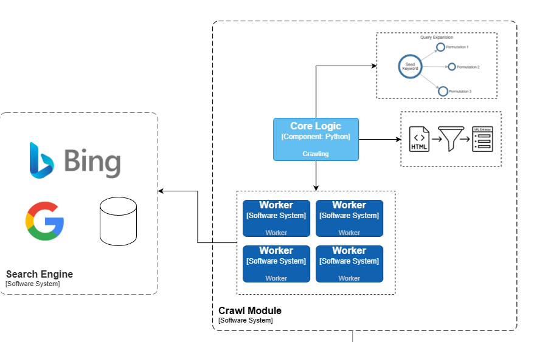
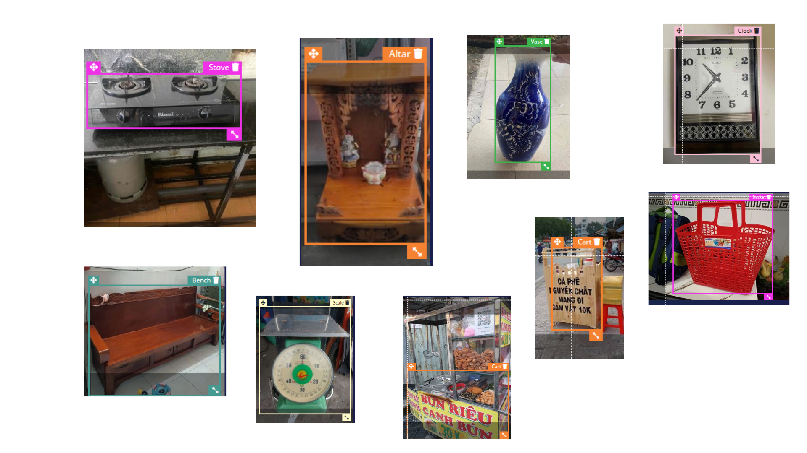
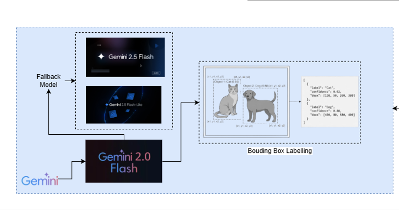
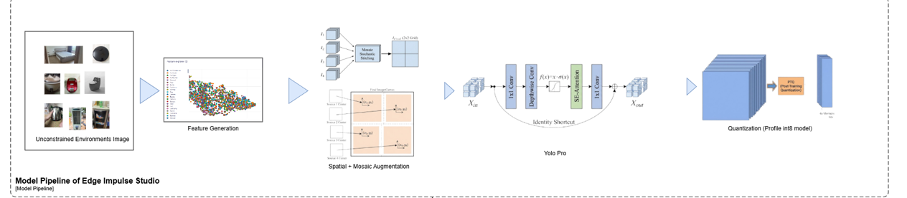

# Virulen / VietLens – Learn English by Scanning Real Objects

Virulen (VietLens) is a **PWA English-learning app** that lets learners in Vietnam point their camera at real-world objects and instantly see their **English word, Vietnamese meaning, pronunciation, and example sentences**.

Instead of memorizing words from Western textbooks, learners build a **collection of cards** from the everyday objects around them – plastic stools, rice cookers, street food, school furniture – the real Vietnam.


**Novelty:**
- New dataset for Vietnam-specific objects (**10k data**) in unconstrained environment
- The app running fully offline in mid-end devices via webapp (which allow both IOS/Android/and any devices with web browser) to run. Benchmark showcase it interface with **200-300ms latency**.


Label Tool Build Around Edge Impulse: https://github.com/quochung-cyou/label-tool-edgeimpulse

<p align="center">
  <a href="https://www.youtube.com/watch?v=c5tncPer468">
    
  </a>
</p>

<p align="center">
  <em>Watch the Virulen / VietLens demo on YouTube</em>
</p>
---

## 1. Why This Exists 

### Tourism & communication

- Vietnam welcomed **12.6M+ international visitors in 2023** (VNAT), but tourism is still concentrated in major cities.
- Reports from World Bank, VNExpress, Tuoi Tre highlight that many rural destinations stay “off the map” because of **communication and English barriers**, not because they lack beauty or culture.

### English education, but out-of-context

- Vietnamese students start English in **Grade 1** (MOET curriculum), yet textbooks and apps are dominated by **urban/Western objects**.
- A 2022 analysis in *Asia TEFL Journal* found that over **80% of vocabulary objects in mainstream textbooks are generic or Western** (e.g., sofa, burger, subway) rather than local Vietnamese items.
- Research by Vietnamese educators shows textbook gaps for things tourists actually see:
  - `cái chõ xôi` (sticky rice steamer)
  - `ghế nhựa` (red plastic stool)
  - `quán cóc` (street stall)
  - `mâm cơm` (family meal tray)

The result is a **visual and cultural mismatch**:
“Chair” in the book is a Western dining chair; “chair” in real life is a plastic stool or bamboo bench. Students memorize the word, but it doesn’t connect to their reality.

### Gap in current apps

- **Language apps** (Duolingo, Memrise, Babbel, Ling, etc.) teach generic vocab; no *offline*, Vietnam-specific **scan-and-learn** for local objects.
- Global datasets and routines miss **Vietnam‑specific foods, tools, and rural scenes**.

**Virulen / VietLens targets this exact gap**:
*Offline-first, locally trained object recognition + English learning, optimized for low-end Android devices in Vietnam.*


## 2. How It Works 


The large diagram below is the end‑to‑end pipeline that produces the on‑device model used in Virulen.  
To make it easier to understand, we break it into four stages.

### 3.1 Web crawl & candidate discovery



This block corresponds to the **left side** of the diagram.

- **Search engines (Bing / Google)**  
  We query public search APIs to discover pages and images that are likely to contain
  Vietnam‑specific objects (street food, local tools, rural scenes, etc.).

- **Crawl module**  
  - **Core Logic** orchestrates crawling and filtering.
  - Multiple **Workers** download pages and images in parallel.
  - Output is a large pool of *candidate images* plus metadata.

This stage answers: **“What images from the web might show the Vietnam objects we care about?”**

---

### 3.2 Data acquisition for Viet‑specific objects



This block is the **middle bottom** of the diagram.

- The crawl output is filtered into **Vietnam bias object data** – images that show
  Vietnamese contexts and artifacts we want the model to recognize.
- A **data acquisition service**:
  - Stores the raw images.
  - Groups them into **samples** (per object / per scene).
  - Prepares preview grids (as shown in the photo‑grid box in the diagram).

This stage answers: **“Which of those images are actually useful for our Vietnam‑focused dataset?”**

---

### 3.3 Labeling & human‑in‑the‑loop



This block is the **bottom‑right**.

- **Produce / Core Logic / Consumer**  
  - A small pipeline (shown with Kafka) feeds images into the labeling tools and
    collects labeled results.
  - Images flow through a **Produce → Label → Consume** cycle.

- **Labeling module (web UI)**  
  - Human labelers see each image (or grid of images).
  - They draw bounding boxes, assign class names, and validate / correct auto‑suggested labels.

- **Gemini fallback (bottom‑left box in the diagram)**  
  - A multimodal model (e.g. Gemini 2.0 Flash) can propose initial labels.
  - Humans confirm or fix them instead of labeling everything from scratch.

This stage answers: **“How do we turn raw images into high‑quality labeled training data?”**

---

### 3.4 Edge Impulse training & deployment



This block is the **top pipeline** and the central Edge Impulse logo.

- **Model pipeline in Edge Impulse Studio**  
  - **Data ingestion**: labeled samples are uploaded into Edge Impulse.
  - **Feature generation**: images are converted into feature vectors.
  - **Model architecture & training**:
    - A CNN / object‑detection network is configured (backbone, head, etc.).
    - Training, validation, and augmentation happen inside Edge Impulse Studio.
  - **Quantization**: the trained model is quantized for efficient on‑device inference
    (the “int8 model” box in the diagram).

- **Export to Virulen**  
  - Edge Impulse exports a **standalone WebAssembly model bundle**.
  - The bundle is placed under `public/edge-impulse/` and loaded in the app by
    `lib/edge-impulse-browser.ts`.
  - `ScanCamera` uses this model to run real‑time detection directly in the browser.


- **Frontend framework:** Next.js 16 App Router, React 19, TypeScript.
- **On-device AI:**
  - `lib/edge-impulse-browser.ts` lazy-loads:
    - `/edge-impulse/edge-impulse-standalone.js`
    - `/edge-impulse/run-impulse.js`
  - `ScanCamera` (`components/scan-camera.tsx`):
    - Captures frames from `getUserMedia` video.
    - Packs pixels into feature vectors (`lib/ei-image.ts`).
    - Calls the Edge Impulse classifier and receives bounding-box detections.
    - Applies simple **per-label non-max suppression** to clean up overlapping boxes.
    - Maps detection labels to card definitions (`lib/card-dictionary.ts` → `findCardByLabel`).

- **State & storage:**
  - User stats, streak, week progress, and collected cards are stored in **`localStorage`** (`lib/storage.ts`).
  - Cards are reconstructed from compact references + dictionary data to keep storage lightweight.

- **UI / UX:**
  - Mobile-first layout (`app/globals.css`, shadcn-style components in `components/ui`).
  - Animated scan overlay and capture animation (`components/detection-overlay.tsx`, `components/capture-card-animation.tsx`).
  - Floating dock navigation (`components/floating-dock.tsx`).


## 3. What the App Does

### Core experience

- **Scan objects with the camera**  
  - The app uses an **Edge Impulse** object-detection model loaded in the browser (`lib/edge-impulse-browser.ts`) to detect objects in real time.
  - Detections are mapped to **curated word cards** (`lib/card-dictionary.json` → `lib/card-dictionary.ts`).

- **Catch and collect vocabulary cards**  
  - Each recognized object becomes a **Word Card** (`lib/card-types.ts`, `lib/word-data.ts`):
    - English word  
    - Vietnamese meaning  
    - Phonetic / pronunciation  
    - Example sentences  
    - Category (e.g., household, food, school, transport)  
    - User-captured images

- **Gamified dashboard (Home page)**  
  - Daily mission word / quest  
  - Weekly progress heatmap (`components/week-progress.tsx`)  
  - Streak, total time spent scanning, and recent scans (`app/page.tsx`, `lib/storage.ts`).

- **Card collection & details**
  - Browse all collected cards (`app/cards/page.tsx`, `components/beautiful-card-collection.tsx`).
  - View detail for each word: meaning, examples, images, and favorites.

- **Offline-friendly PWA**
  - Next.js PWA setup (`app/manifest.ts`, `app/layout.tsx` + `SwRegister`) with:
    - `start_url: "/virulen/"`  
    - `display: "standalone"`  
  - Edge Impulse model & runtime served from static assets under `public/edge-impulse/`.
  - Designed to run on **low-spec phones** with no stable internet.


---

## 4. Tech Stack

- **Framework:** Next.js 16 (App Router, TypeScript)
- **Language:** TypeScript, React 19
- **Styling:** Tailwind CSS 4, custom mobile-focused CSS, shadcn/ui components, Lucide icons
- **AI / CV:** Edge Impulse WebAssembly classifier, custom Vietnam-focused dataset (served from `public/edge-impulse`)
- **Speech (optional):** `vosk-browser` (script loaded in `app/layout.tsx` for browser speech recognition)
- **Storage:** `localStorage` for cards, favorites, and stats
- **Animations:** `framer-motion`, CSS animations

---

## 5. Getting Started

### Prerequisites

- **Node.js** ≥ 18
- Package manager: **pnpm** (recommended), or npm.
- A modern browser with camera support (for development).

### Installation

```bash
# in the repo root
pnpm install
# or
npm install
```

### Run in development

```bash
pnpm dev
# or
npm run dev
```

By default this runs on `http://localhost:3000`.
Open it on a device with a camera (you can also use your laptop camera).

> Note: In dev, base paths may differ from production (`next.config.mjs` uses `basePath: "/virulen"` and `assetPrefix: "/virulen/"` for static export).

### Build & static export

This project is configured for **static export**:

```bash
pnpm build
# then
pnpm start   # Next.js standalone server
```

Or, if you run `next export` in your deployment pipeline, ensure you respect:

- `basePath: "/virulen"`
- `assetPrefix: "/virulen/"`
- Static assets required for Edge Impulse under `public/edge-impulse/`.

---

## 6. Key Directories

- **`app/`**
  - `page.tsx` – Home dashboard (stats, daily mission, quick actions, recent scans).
  - `scan/page.tsx` – Scan screen (integrates `ScanCamera`, current detections, “catch” animation).
  - `cards/` – Card list and detail pages.
  - `manifest.ts` – PWA manifest.
  - `layout.tsx` – Root layout, fonts, PWA & speech scripts.

- **`components/`**
  - `scan-camera.tsx` – Core camera + Edge Impulse pipeline.
  - `detection-overlay.tsx` – Renders bounding boxes.
  - `beautiful-card-collection.tsx`, `word-card-item.tsx`, `word-card-modal.tsx` – Collection UI.
  - `floating-dock.tsx`, `stats-card.tsx`, `week-progress.tsx` – Navigation and dashboard UI.
  - `audio-recorder.tsx` – Voice features (for pronunciation practice and missions).

- **`lib/`**
  - `edge-impulse-browser.ts` – Loads and instantiates the Edge Impulse classifier.
  - `ei-image.ts` – Packs camera frames into features for the model.
  - `card-dictionary.json` – Dictionary of all supported words and metadata.
  - `card-dictionary.ts` / `card-types.ts` – Card models and helper functions.
  - `storage.ts` – Local storage for cards, favorites, and user stats.
  - `asset-path.ts` – Base path helper for static assets.

- **`public/edge-impulse/`**
  - Edge Impulse generated files (`edge-impulse-standalone.js`, `run-impulse.js`, model assets).

---

## 7. Roadmap / Ideas

- **Richer Vietnam-specific dataset**
  - Expand `card-dictionary.json` with more rural artifacts, foods, and tools.
  - Community-sourced images and labels from classrooms and local guides.

- **Education edition**
  - Teacher dashboard: see which words a class has “caught”.
  - Thematic missions: “Market day”, “School day”, “Kitchen tour”.

- **Tourism bridge**
  - Tourist mode: phrasebook + object scan for travelers.
  - Local mode: help locals explain cultural items to visitors (e.g., `điếu cày`, `nón lá`, `bánh xèo`).

- **Richer speech & pronunciation**
  - Integrate `vosk-browser` fully for **offline pronunciation practice** and voice-based quizzes.

- **Data & research**
  - Partner with educators and tourism experts to validate vocabulary lists.
  - Open data contributions (anonymized) to support further research on **low-resource, domain-specific object recognition**.

---

## 8. License & Attribution


- Acknowledge **Edge Impulse** for on-device ML tooling.